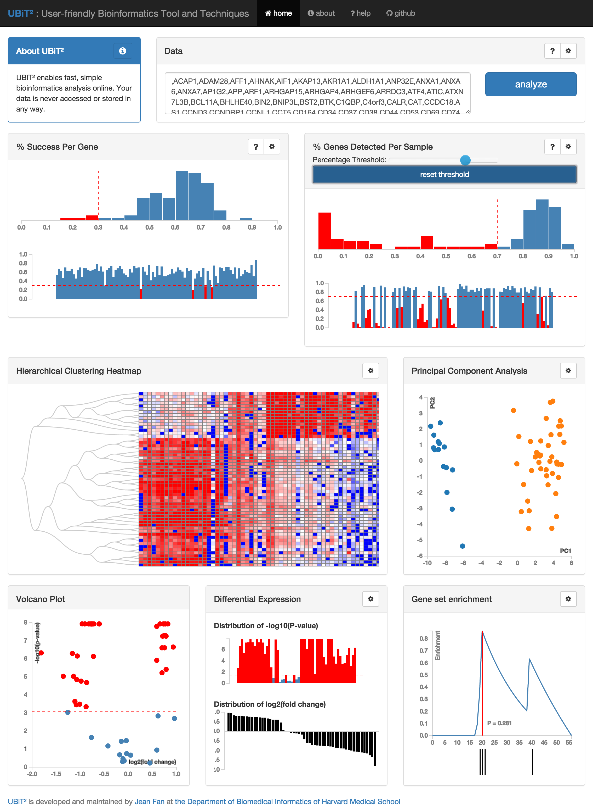

UBiT2 is a free, open-source, user-friendly web-service that enables fast, simple bioinformatics analysis online. No downloads, installations, registration, or accounts are needed. Your data is never accessed or stored in any way. Using just a browser, users can copy and paste in their data to perform standard analyses such as quality control, filtering, hierarchical clustering, principal component analysis, differential expression analysis, gene set enrichment testing, and more, all with interactive visualizations.

Compile locally with [Jekyll](https://help.github.com/articles/setting-up-your-github-pages-site-locally-with-jekyll/)!
# Try it out ☞ [ubit2.com](http://ubit2.com/)  

